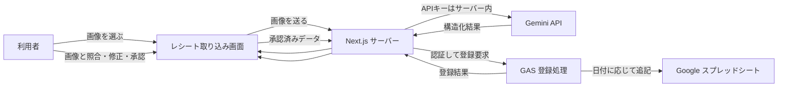

# スプレッドシート連携のアーキテクチャ案

**状態：検討中。実運用に使えるGAS連携としての動作確認は未完了。**

リポジトリにGASの試作コードと架空台帳はあるが、レシート画像の解析から、人の確認、GAS経由の台帳登録までを一連の機能として使える状態にはなっていない。後続の担当者は、既存コードを完成済みの実装と見なさず、実際の台帳運用を確認してから設計・実装する。

[架空台帳（形式の参考用）](https://docs.google.com/spreadsheets/d/1IZ4Q6p-0NGgo-jhbtUueduCIJEpOw2yr9MiONWdzcEk/edit)

## 目指す流れ

これは候補の構成で、接続方法や認証方式は未決定。少なくとも、GeminiのAPIキーはGASやブラウザーに置かず、画像解析はサーバー側で行う。解析結果は自動で確定せず、人が元画像を確認・修正してから登録する。

## コンポーネントの役割案

- **取り込み画面**：画像選択、解析状態、画像と読み取り結果の照合、修正、登録前の承認。
- **Next.jsサーバー**：Gemini APIキーの保護、画像解析、入力検証、登録要求の作成、GAS応答の表示。
- **GAS**：承認済みデータの再検証、登録IDによる重複防止、同時書き込み制御、対象月タブへの登録。
- **スプレッドシート**：実際の台帳。列、残高式、費目、月の扱いは現行台帳を確認して決める。

## 実装前に確認すること

### 実際の台帳と業務ルール

- 現行シートの列、月ごとのタブ名、期首残高と月間繰越の方法。
- 費目の一覧、支払方法、現金以外・立替・入金の扱い。
- 誰が読み取り内容を確認・承認し、誰が台帳を編集できるか。
- 1レシートを何行で登録するか。商品明細、税率別税額、領収書をどこまで残すか。
- 元画像を保存するか、保存先・閲覧権限・保存期間をどうするか。
- 解析日と取引日が異なる場合や、過去月の訂正・締め後の変更をどう扱うか。

### GASへの安全な接続

- Next.jsサーバーからGAS Webアプリを呼ぶか、Google Sheets APIなど別の接続を使うか。
- GAS実行主体、Google Workspaceの認証方法、許可する利用者とシートを決める。
- 認証のない公開エンドポイントに台帳書き込みを許さない。呼び出し元の認証・認可、秘密情報の保存場所、失効方法を決める。
- 画面からの二重送信や通信切断後の再送に備え、承認時に発行した安定した登録IDで冪等性を確保する。
- 登録成功・入力エラー・認証失敗・通信失敗を画面で区別し、失敗時に同じ登録IDで安全に再試行できるようにする。

### データ形式と変換

- Geminiの項目（店舗名、取引日、金額、税額、支払方法、登録番号、明細）と台帳列の対応を定める。
- 日本円の整数、日付、空欄、複数税率、負数・返品などの扱いを決める。
- 店舗名・摘要・明細をどのように台帳向けに編集・短縮するかを決める。
- OCRの読み取り結果、利用者の修正値、台帳へ登録した値のうち、どれを監査用に残すか決める。

## 推奨する段階

1. 実際の台帳のコピーまたは専用の架空台帳で、列と業務ルールを確認する。
2. API接続前に、承認済みの固定JSONを使って、GASの入力検証・月タブ選択・重複防止を実装する。
3. 利用者認証とサーバーからGASへの接続方法を決める。キーをブラウザーへ渡さない。
4. 画面で人が直した内容だけを、安定した登録IDとともに送る。
5. 二重送信、通信失敗後の再送、異なる月、権限不足、無効値を確認する。
6. 実際のレシートを扱う場合は、公開データの検証と分け、Gemini APIへの送信条件と画像保管方針を確認する。

## 現在あるもの

- Next.jsのレシート画像一括解析画面と、Gemini API呼び出し。
- Apps Scriptの試作ファイル（`gas/Code.gs`、`gas/ReceiptDialog.html`、`gas/appsscript.json`）。
- 架空データ・架空月タブで作った参考用スプレッドシート。

これらは後続作業の参考資料。解析画面からGASへ登録する接続、実際の台帳に合わせた項目設計、実運用としてのE2E確認は未完了。

## 関連資料

- [調査まとめ](./research-summary-2026-10-06.md)
- [一括解析の設計と使い方](./batch-analysis.md)
- [計測・確認記録](./README.md)
