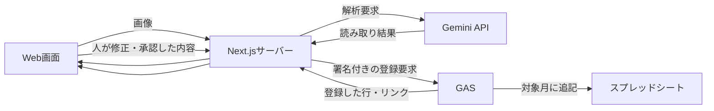

# スプレッドシート連携のアーキテクチャ案

レシートの解析・確認をWeb画面で行い、承認した内容をGAS経由でスプレッドシートに登録する構成を考えた。既存の画像解析PoCに、確認・承認画面と台帳への登録処理を追加すれば実現できる。

**画像解析は実装済み。ここに書いた確認・承認と台帳への連携は、まだ実装・動作確認をしていない。**

## 全体の流れ

画像を選ぶ → Geminiで解析 → 元画像と照合・修正 → 人が承認 → GASへ送信 → 月別タブに登録、という流れにする。

## 各部分の役割

| 部分 | 担当すること |
| --- | --- |
| Web画面 | 元画像と結果を並べ、金額・日付・支払先を修正する。費目と摘要を入力し、「承認して登録」で確定する |
| Next.jsサーバー | Geminiの呼び出しとキーの管理。承認済みデータを検証し、台帳用の形式に整えてGASへ送る |
| GAS | 登録要求の認証、入力と登録IDの検証、月別タブへの書き込み。登録したタブ・行番号・リンクを返す |
| スプレッドシート | 小口出納台帳。取引を保存し、残高を数式で計算する |

Geminiのキーはサーバー内に保管する。GASへ送るのは承認後の値で、画像解析はNext.js側に任せる。

## 台帳に記録する内容

まずは「現金の出金・1レシート1行・月別タブ」を前提にする。取引日から `2026-10` のような対象月を選び、次の項目を記録する。

- 取引日、支払先、摘要、費目
- 出金額、税額、支払方法、適格請求書発行事業者の登録番号
- 登録ID、承認者、登録日時

費目と摘要は人が入力する。残高は台帳の数式で計算し、AIには計算させない。対象月のタブがなければ登録を止め、画面に理由を返す。

実際の台帳が月別でなければ、登録先の選び方を変更する。列や費目も現行台帳に合わせる。商品明細を別シートに残すかどうかは、台帳で必要な情報を見て決める。

[架空台帳](https://docs.google.com/spreadsheets/d/1IZ4Q6p-0NGgo-jhbtUueduCIJEpOw2yr9MiONWdzcEk/edit)は列構成の参考として作ったもの。

## 登録要求と二重登録への対応

Webアプリで利用者を認証し、承認した内容だけを登録する。サーバーからGASへは、本文と時刻にHMAC署名を付けて送る。GASは署名と有効期限を確認し、書き込み先は指定した台帳に限定する。署名用の秘密はサーバーとGAS内に保管し、ブラウザには渡さない。

各レシートには固定の登録IDを付ける。GAS側で登録済みか確認し、同じID・同じ内容なら既存の登録結果を返す。内容が違う場合は上書きせず、確認を求める。

同時書き込みはGASのスクリプトロックで制御する。通信が切れて登録結果が分からなくなっても、同じIDで再送すれば二重登録を防げる。台帳への再送時にGeminiを呼び直す必要はない。

## 技術的に実現できる根拠

GASには必要な機能が揃っている。

- [Webアプリ](https://developers.google.com/apps-script/guides/web)：HTTP POSTで登録要求を受け取れる。
- [Spreadsheetサービス](https://developers.google.com/apps-script/reference/spreadsheet/sheet)：対象タブの選択と行への書き込みができる。
- [Utilities](https://developers.google.com/apps-script/reference/utilities/utilities)：HMAC署名を計算し、受信した要求の署名と照合できる。
- [LockService](https://developers.google.com/apps-script/reference/lock/lock-service)：複数の登録処理が同時に同じ行へ書き込むのを防げる。

これらを組み合わせれば、今回の構成は技術的に実現可能と考えている。実装時には、GASを実行するアカウントのシート権限と、Workspaceで許可されるWebアプリの公開範囲を確認する。

## 現在できていること

できているのは、Next.js画面からGeminiへ画像を送り、読み取り結果を表示する部分。確認・修正・承認画面、サーバーとGASの接続、署名認証、承認済み結果の台帳登録は未実装・未検証。

架空台帳は試作時の資料として残している。アプリから使われていなかったGASの試作コードはリポジトリから外した。必要なら[試作時のGit履歴](https://github.com/kuraryu405/receipt-import-poc/tree/511f396/gas)を参照できる。このリポジトリには台帳連携の設計案だけを残している。

Geminiの利用枠は解析側で引き続き必要になる。GASと連携しても、今回ぶつかったレート制限が解消するわけではない。

## 関連資料

- [調査まとめ](./research-summary-2026-10-06.md)
- [一括APIの仕様と操作方法](./batch-analysis.md)
